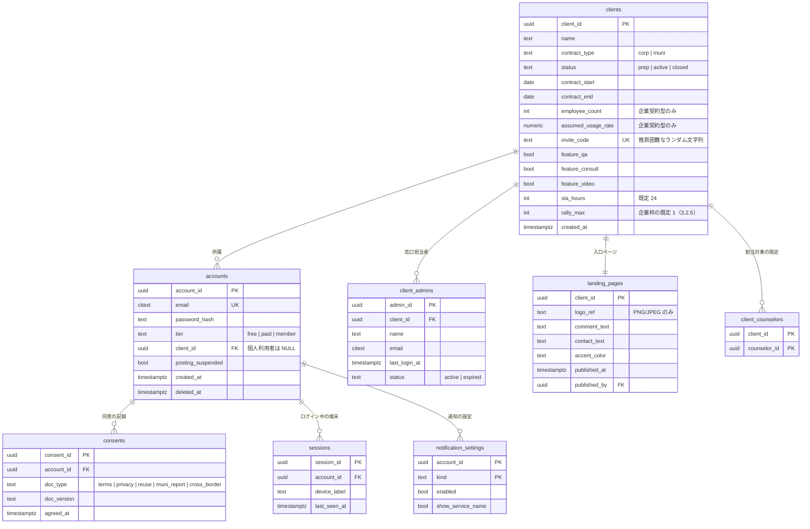
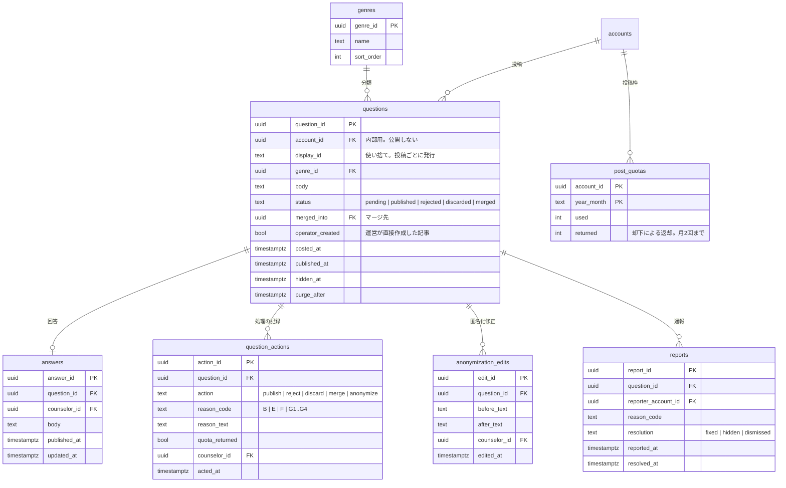
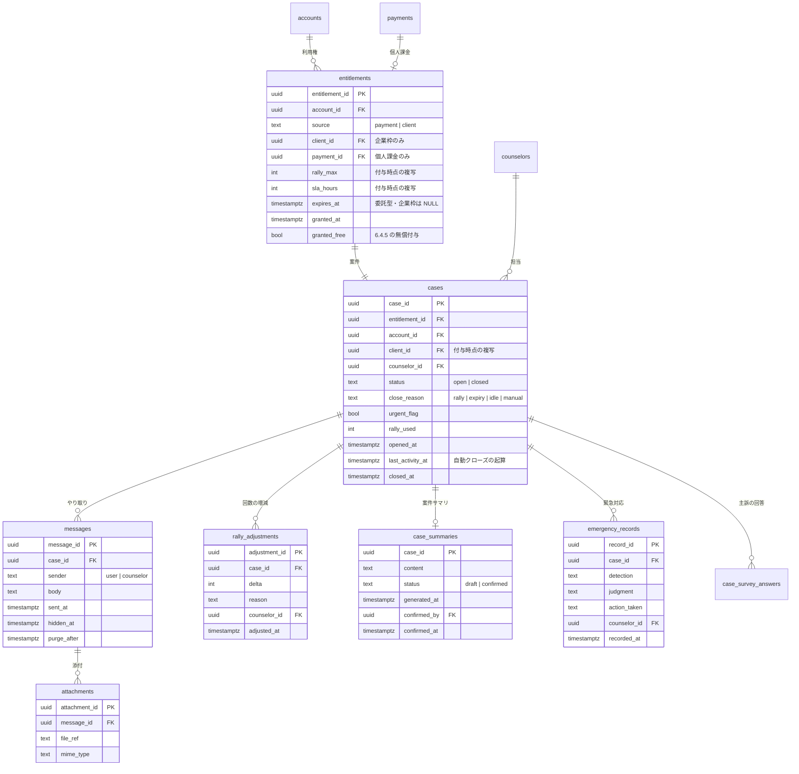
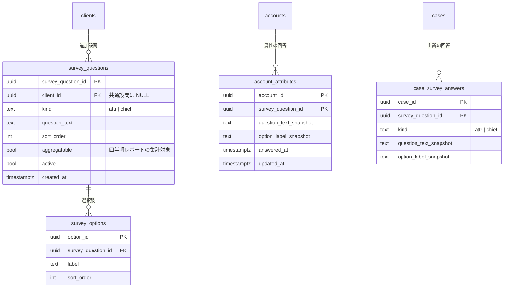
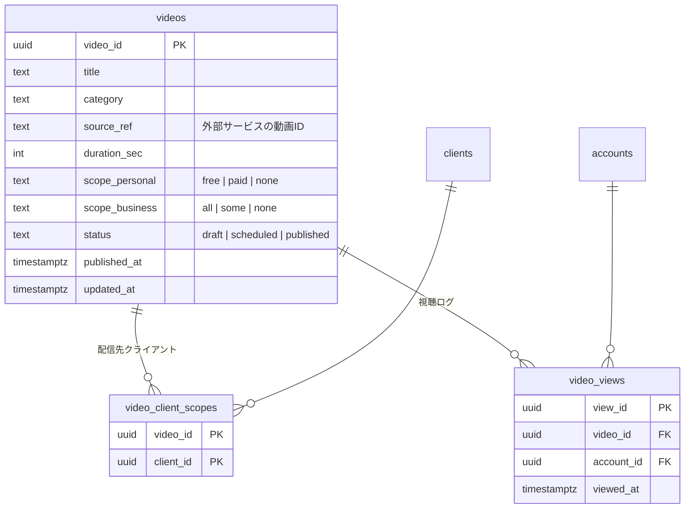
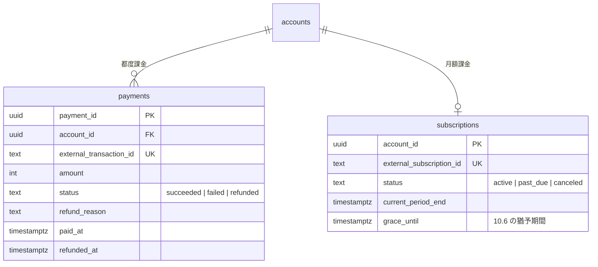
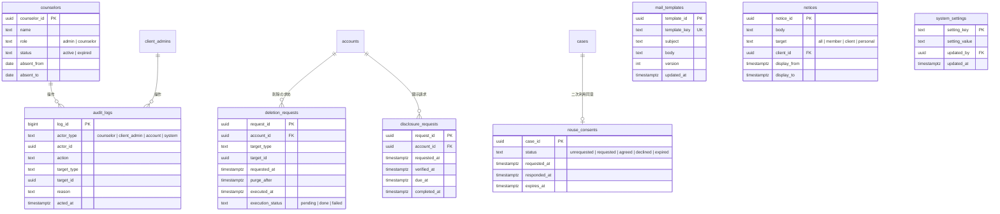

# データモデル設計

**相談サービス基盤構築プロジェクト**

| 項目 | 内容 |
|---|---|
| 文書番号 | SRD-2026-001-DM |
| 版数 | Version 1.0 |
| 発行年月日 | 2026年8月20日 |
| 対応する要件定義書 | Version 6.6 |
| 機密 | 社内限り（Confidential） |

本書は「システム機能要件定義書（SRD-2026-001）」の Version 6.6 に対応する。要件の変更時は本書もあわせて改訂する。

---

## 0. 設計方針

実装に先立ち、要件から導かれる構造上の原則を示す。個々のテーブル定義はこれらの原則に従う。

### 0.1 スナップショット原則

**設定値および設問文は、参照時点の値ではなく、確定時点の値を複写して保持する。**

| 複写するもの | 複写先 | 根拠 |
|---|---|---|
| 返信SLA | `entitlements` → `cases` | 3.2.4 |
| ラリー回数 | `entitlements` → `cases` | 3.2.5 |
| 有効期間 | `entitlements` → `cases` | 3.2.6 |
| 契約クライアント | `entitlements` → `cases` | 3.11.8 |
| 設問文・選択肢ラベル | `case_survey_answers` | 3.11.8 |
| 属性の回答 | `accounts` → `cases` | 3.11.9 |

複写しない場合、設定変更により**過去の集計値および進行中の案件が遡って変動する**。四半期レポートの数値が後から変わる、対応中の案件の残回数が予告なく減る、といった事象を招く。

### 0.2 client_id によるスコープ

契約クライアント単位の分離は、単一データベース上の行レベルのアクセス制御により行う（8.6.1）。`client_id` を持つテーブルには、当該列を条件とするポリシーを設定する。

- 個人利用者は `client_id` が `NULL`
- アプリケーション側の条件指定に依存せず、データベースのポリシーで担保する（3.11.8の実装上の留意点）

### 0.3 表示識別子と内部識別子の分離

機能1の投稿は、公開画面において投稿ごとの使い捨て識別子を表示する。内部的には会員との紐付けを保持する（2.6）。

- `questions.display_id` — 公開用。投稿ごとに発行
- `questions.account_id` — 内部用。投稿上限のカウント、削除依頼への対応、通報対応に用いる

### 0.4 削除の段階

物理削除は即時に行わない（9.3）。

```
削除操作 → hidden_at を設定（利用者から不可視）
        → purge_after を設定（猶予期間）
        → 定期処理で物理削除、purged_at を記録
```

決済記録および監査ログは対象外とし、本文とは別テーブルに分離して保持する。

### 0.5 追記専用テーブル

`audit_logs` は挿入のみを許可し、更新・削除のポリシーを設定しない（7.16）。

### 0.6 属性と主訴の帰属先

初回アンケートの回答は、分類により帰属先が異なる（3.11.2）。

- **属性** → `account_attributes`（利用者に帰属。マイページから修正可）
- **主訴** → `case_survey_answers`（案件に帰属。修正不可）

---

## 1. 契約・アカウント



**設計上の注記**

| 項目 | 内容 |
|---|---|
| `clients.contract_type` | 登録後に変更できない（3.12.2）。データベース側でも更新を禁止するトリガまたはポリシーを設ける |
| `clients.status` | `prep` の間は `invite_code` による所属の紐付けを行えない（7.10.9） |
| `accounts` に氏名を持たない | 3.10.5。企業会員・委託型を問わず、当社は氏名を保持しない |
| `client_admins` には氏名を持つ | 契約の窓口担当者であり、サービスの利用者ではない（7.6.5） |
| `accounts.tier` | `member` は契約クライアント所属者。所属解除時は `free` へ変更（2.4） |
| `consents.doc_version` | 10.8。同意した版を特定できない構成としない |

---

## 2. 機能1：会員投稿型Q&A



**設計上の注記**

| 項目 | 内容 |
|---|---|
| `questions.display_id` | 2.6。公開画面ではこれのみを表示する。`account_id` を公開経路に載せない |
| `questions.operator_created` | 7.11.1。運営が直接作成した記事は `display_id` を持たない |
| `question_actions.quota_returned` | 6.4.6。破棄（G区分）は `false`。返却は月2回が上限 |
| `post_quotas.returned` | 月間の返却回数を保持し、上限判定に用いる |
| 通報者への結果通知 | 行わない（7.11.3）。`reports` に通知先を持たせない |

---

## 3. 機能2：相談



**設計上の注記**

| 項目 | 内容 |
|---|---|
| `entitlements` と `cases` の分離 | 付与済みで未開始の状態を表現するため分離する。1対1 |
| `entitlements.rally_max` `sla_hours` `expires_at` | 0.1 のスナップショット原則。付与時点の設定を複写する。**企業枠は `expires_at` が NULL**（無期限。3.2.6）。`rally_max` は付与元を問わず設定される（3.2.5） |
| `cases.client_id` | 参照時点の `accounts.client_id` を用いない。所属の変更により過去の集計が変動するため（3.11.8） |
| `cases.last_activity_at` | 3.2.6。企業枠の無操作による自動クローズの起算に用いる。送信のたびに更新する |
| 同時進行1件の制限 | `cases` に `status = 'open'` の行が存在する間、新たな `entitlements` を付与しない。判定と挿入を同一トランザクションで排他制御する（8.3） |
| **経緯サマリを保持しない** | 3.9.2。参照時に**確定済みの** `case_summaries` から都度生成する。進行中の案件は入力に含めない。逐次更新方式による情報の劣化を避けるため。<br>ただし入力となる案件サマリの集合から算出した値を鍵として結果を一時保持してよい。入力が同一なら結果も同一のため劣化しない |
| `case_summaries` は**個人課金の案件のみ** | 3.9.2。企業枠は案件サマリを生成せず、経緯サマリの入力に `messages` を直接用いる |
| `case_summaries.status` | 3.9.3。進行中は `draft` で随時上書きし、クローズ時に `confirmed` として確定する。確定後は更新しない |
| **クローズ済み・未確定の中間状態** | `cases.closed_at IS NOT NULL AND case_summaries.status = 'draft'`。この状態も経緯サマリの入力に含める。含めない場合、レビューが滞留した案件が次回の相談時に存在しないものとして扱われる（3.9.3） |
| `case_summaries` に機能1のデータを含めない | 3.9.1。生成処理から `questions` への参照経路を設けない |
| `counselors.name` を利用者向けの経路に載せない | 3.6.1。`messages` は `sender` の区分のみを持ち、相談員を識別する列を持たない |

---

## 4. アンケート



**設計上の注記**

| 項目 | 内容 |
|---|---|
| `survey_questions.client_id` | `NULL` は共通設問。取得時は `client_id IS NULL OR client_id = :account_client_id` で絞り込む |
| `kind` | 3.11.2。`attr` は初回のみ、`chief` は毎回聴取する |
| `question_text_snapshot` `option_label_snapshot` | 設問の編集・削除により過去の回答の意味が失われることを防ぐ（3.11.8） |
| `account_attributes` の修正 | マイページから可能（3.11.9）。修正は次回の相談から反映し、`case_survey_answers` に複写済みの値は変更しない |
| 「答えない」 | 未回答と区別するため、選択肢の一つとして値を保持する（3.11.2） |
| 追加設問の上限 | 1クライアントあたり `active` な行を2件までとする（3.11.8） |

---

## 5. 機能3：動画



**設計上の注記**

| 項目 | 内容 |
|---|---|
| 2軸の配信範囲 | 4.2.1。`scope_personal` と `scope_business` を独立に指定し、いずれかで対象に含まれる場合に視聴できる |
| 両方が `none` | 公開できない。制約またはアプリケーション側の検証で拒否する（7.7.3） |
| `video_client_scopes` | `scope_business = 'some'` の場合にのみ行を持つ |
| `video_views` | 個人単位でクライアントへ開示しない（4.4）。集計値のみを四半期レポートに含める |

---

## 6. 決済



**設計上の注記**

| 項目 | 内容 |
|---|---|
| 保持期間 | 法定保存義務の対象。9.3の削除処理から除外し、本文のテーブルとは分離して保持する |
| 企業枠 | 決済を経由しない。`entitlements.source = 'client'` の行は `payment_id` を持たない（8.3） |
| `subscriptions.grace_until` | 決済失敗後の猶予期間。経過により `accounts.tier` を `free` へ変更する |

---

## 7. 運営・監査・権利行使



**設計上の注記**

| 項目 | 内容 |
|---|---|
| `audit_logs` | 挿入のみ。更新・削除のポリシーを設定しない（7.16） |
| 重点監視対象の `action` | 相談内容へのアクセス、投稿履歴の例外開示、CSV出力、開示請求への対応、配信範囲の変更、権限の付与・変更 |
| `deletion_requests.execution_status` | `failed` の滞留を検知してアラートを出す（7.13.1） |
| `reuse_consents` | `agreed` の案件のみが記事化の素材となる（7.13.3） |
| `system_settings` | 7.18。ラリー回数、有効期間、各種閾値を保持する |
| 自治体委託型の報告 | 委託元は `client_admins` のアカウントで `cases` および `messages` を参照する（3.12.3）。参照は `audit_logs` に記録する |

---

## 8. 主要な制約の一覧

実装時に、データベースの制約またはアプリケーション側の検証として設ける。

| # | 制約 | 根拠 |
|---|---|---|
| 1 | `clients.contract_type` は更新できない | 3.12.2 |
| 2 | `clients` の `feature_qa` `feature_consult` `feature_video` がすべて `false` となる更新を拒否 | 3.10.7 |
| 3 | `videos` の `scope_personal` と `scope_business` がともに `none` の状態で `status = 'published'` にできない | 7.7.3 |
| 利用者向けの参照経路および `10.3.4` の出力に `counselors.name` を含めない | 3.6.1 |
| 4 | 1つの `account_id` について `cases.status = 'open'` の行は1件まで | 3.2.3 |
| 11 | `case_summaries.status = 'confirmed'` の行を更新できない | 3.9.3 |
| 5 | `survey_questions` は1つの `client_id` について `active` な行を2件まで | 3.11.8 |
| 6 | `post_quotas.returned` は月2件を上限とする | 6.4.6 |
| 7 | `client_admins` は1つの `client_id` について `active` な行を1件以上保つ | 7.6.5 |
| 8 | `audit_logs` に対する `UPDATE` `DELETE` を許可しない | 7.16 |
| 9 | `entitlements.source = 'client'` の行は `payment_id` を持たない | 8.3 |
| 10 | `accounts.client_id` が `NULL` の利用者に、`survey_questions.client_id` が非 `NULL` の設問を表示しない | 3.11.8 |

---

## 9. 定期処理

| 処理 | 頻度 | 根拠 |
|---|---|---|
| 猶予期間を経過した本文の物理削除 | 日次 | 9.3 |
| 企業枠の無操作による自動クローズと予告通知 | 日次 | 3.2.6 |
| 二次利用同意の督促・失効 | 日次 | 7.13.3 |
| クライアント管理者アカウントの自動失効 | 日次 | 7.6.5 |
| SLA超過の検知と稼働逼迫アラート | 随時 | 7.1 |
| 有効期間満了の予告（個人課金） | 日次 | 3.4 |
| 四半期レポートの集計 | 四半期 | 7.6.3 |
| クライアント別の利用率集計 | 月次 | 3.2.3 |

---

## 10. 本書の未確定事項

要件定義書 Version 6.6 の未決事項のうち、データモデルに影響するものを示す。

| 要件書 No. | 事項 | 影響 |
|---|---|---|
| 5 | 外部SNS連携の要否 | メッセージの取得元および `messages` の構造 |
| 15、58 | LLMサービス・基盤サービスの選定 | 保管先、暗号化の要否 |
| 47 | SLAの起算方式 | `cases` にSLA残り時間の算出基準を持たせるか |
| 62 | 自治体委託型における匿名性の取扱い | `accounts` に氏名を持たせる必要が生じ得る |
| 10 | 未成年者の利用可否 | 年齢確認、保護者同意の記録が必要となり得る |

**特に No.62 は本書の前提を変える。** 3.10.5に基づき `accounts` に氏名を保持しない構成としているが、委託契約が実名での報告を求める場合、当該前提が成立しない。受託の可否判断に先立ち確定を要する。

---

**- 本書終わり -**
